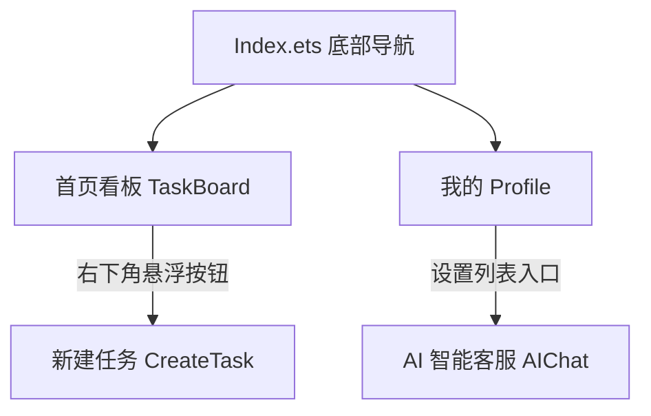

# 团队协作管理 App (Efficient Flow) - HarmonyOS

## 项目概览
本项目是一个基于 HarmonyOS (ArkTS + ArkUI) 构建的轻量化企业办公与生产力类团队任务管理 App。参考了 Modern Minimalism（极简现代）风格与 Tech Blue (#0066FF) 的品牌色调进行开发。

## 功能特性
1. **多页面架构**: 实现了包含首页、任务看板、AI智能客服、个人中心的底部 Tab 导航结构。
2. **任务看板与管理**: 支持按“待办”、“进行中”、“已完成”标签切换查看任务，支持拖拽对任务项进行列表内排序，支持关键字搜索过滤。
3. **新建任务**: 提供了带验证的任务表单，集成了下拉选项 (`Select`) 选取负责人以及日期选择器 (`DatePickerDialog`) 设置截止时间。
4. **AI 客服**: 内置 AI 助手聊天界面，支持模拟的大模型对话交互。
5. **本地持久化**: 采用 `@ohos.data.preferences` (用户首选项) 对任务数据进行本地存储，保证退出 App 后数据不丢失。
6. **个人中心**: 包含用户信息，以及动态的环形进度图（利用 `DataPanel` 组件）显示本周任务完成度。

## 环境要求
- **IDE**: DevEco Studio 3.1+ (或 4.0+)
- **SDK**: HarmonyOS API 9 / 10 / 11

## 如何运行与打包安装包 (.hap)
1. 打开 DevEco Studio。
2. 选择 **File > Open**，选中 `/Users/liyuteng/Documents/finalProject` 目录。
3. 等待 Gradle / Hvigor Sync 完成。
4. 打开 `entry/src/main/ets/pages/Index.ets`，点击右侧的 **Previewer** 进行实时预览。
5. **打包安装包**: 点击 DevEco Studio 顶部菜单栏的 **Build** -> **Build Hap(s)/APP(s)** -> **Build Hap(s)**。编译完成后，可以在 `entry/build/default/outputs/default/` 目录下找到生成的 `.hap` 安装包，供真机安装或分发。

## 目录结构
- `entry/src/main/ets/pages/Index.ets`: 主入口与底部导航条。
- `entry/src/main/ets/pages/TaskBoard.ets`: 任务看板界面（列表、搜索、拖拽）。
- `entry/src/main/ets/pages/CreateTask.ets`: 新建任务界面。
- `entry/src/main/ets/pages/AIChat.ets`: AI 聊天页面。
- `entry/src/main/ets/pages/Profile.ets`: 个人信息与进度面板页面。
- `entry/src/main/ets/utils/TaskStore.ets`: 本地持久化封装工具类。

## 系统架构图

## 数据结构设计

本应用采用 JSON 格式对任务对象进行序列化并持久化存储。`Task` 数据结构定义如下：

| 字段名 | 类型 | 说明 |
| --- | --- | --- |
| `id` | string | 任务唯一标识（使用时间戳生成） |
| `title` | string | 任务标题（必填项，空值将拦截） |
| `description` | string | 任务详细描述（选填） |
| `assignee` | string | 任务负责人（看板支持按此字段分类筛选） |
| `dueDate` | string | 截止时间（如: 10/24/2026） |
| `priority` | string | 优先级（高优先级 / 普通） |
| `status` | string | 任务生命周期状态（待办 / 进行中 / 已完成） |

## API 接口说明

AI 智能客服模块采用通用的基于 HTTPS POST 的大语言模型（LLM）对话补全 API 规范进行接入。

- **请求协议**: `HTTPS (POST)`
- **通信路径**: `https://api.openai.com/v1/chat/completions` (或兼容的服务商地址)
- **请求头 (Header)**:
  - `Content-Type`: `application/json`
  - `Authorization`: `Bearer YOUR_API_KEY`
- **请求体 (Body)**:
  - `model`: 模型标识字符串 (如 `gpt-3.5-turbo`)
  - `messages`: 会话上下文数组，包含 `role` (系统/助手/用户) 与 `content` (正文)。
