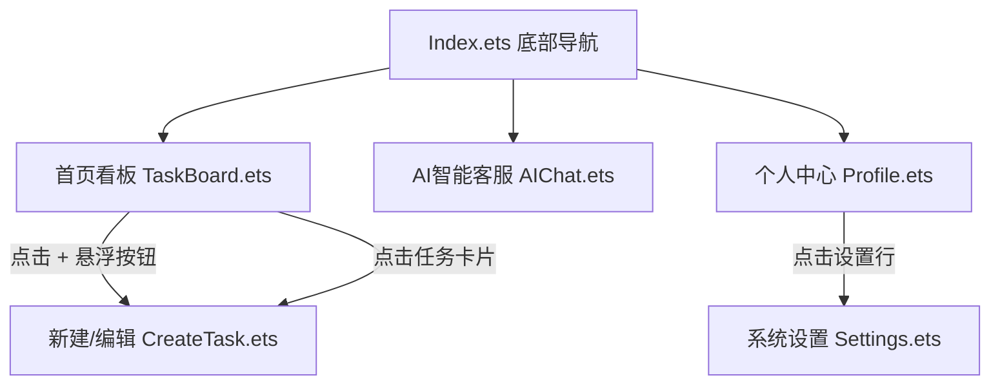

# LiteWork 团队协作管理 App —— 核心开发文档

LiteWork 是一款基于 HarmonyOS (API 9+) 构建的轻量化企业办公与生产力类团队任务管理工具。本应用采用 **Modern Minimalism（极简现代）** 风格与 **Tech Blue (#0066FF)** 品牌色调进行设计与实现。

---

## 一、 技术栈与核心依赖

| 模块 | 技术方案 | 核心接口/组件 | 说明 |
| --- | --- | --- | --- |
| **开发语言与 UI** | ArkTS + ArkUI | `List`, `ForEach`, `DataPanel`, `Select` | 响应式声明式 UI 构建 |
| **本地持久化** | 用户首选项 (Preferences) | `@ohos.data.preferences` | 轻量级 K-V 本地数据存储 |
| **网络请求** | 系统 HTTP 客户端 | `@ohos.net.http` | 用于连接 AI 大模型服务接口 |
| **路由导航** | 系统路由服务 | `@ohos.router` | 支持跨页面跳转、传参和编辑回填 |
| **多主题** | 系统资源机制 + `AppStorage` | `base/element/color.json`, `dark/...` | 适配全局深色/浅色自适应切换 |

---

## 二、 系统架构设计

系统采用扁平的多页面架构，由底部的 Tab 导航进行统筹管理。



### 页面模块职责划分
1. **Index.ets**: 主入口页面。构建了底部 Tab 导航结构，托管「首页看板」、「AI客服」、「个人中心」三大模块，并处理系统深色模式的全局状态绑定。
2. **TaskBoard.ets**: 核心看板。支持按照“待办”、“进行中”、“已完成”标签切换列表；支持任务的**双维度搜索**（任务标题、负责人）；实现列表内的卡片长按拖拽排序。
3. **CreateTask.ets**: 动态表单页面。支持“新建任务”与“修改任务”两种模式。支持必填项校验（标题为空拦截）、负责人下拉选择、截止日期组件 (`DatePickerDialog`) 等。
4. **AIChat.ets**: 智能客服。接入 `agnes-2.0-flash` 模型，能动态拉取当前看板的所有任务作为上下文。支持对话生成、打字态展示，并可以通过 AI 识别指令来控制系统深色模式。
5. **Profile.ets**: 个人中心。展示用户信息，使用环形数据面板 (`DataPanel`) 动态计算本周的任务完成度（已完成/总任务）。
6. **Settings.ets**: 系统设置。提供深色/浅色主题手动切换开关，控制全局 UI 色调。

---

## 三、 数据结构设计

应用数据主要包含任务（`Task`）和聊天消息（`ChatMessage`）两个结构。

### 1. 任务数据结构 (`Task`)
```typescript
export interface Task {
  id: string;          // 任务唯一标识（使用 Date.now().toString() 生成）
  title: string;       // 任务标题（必填）
  description: string; // 任务描述（选填）
  assignee: string;    // 负责人（默认为“未分配”）
  dueDate: string;     // 截止日期（格式 yyyy-MM-dd，默认为“无”）
  priority: string;    // 优先级（高 / 普通）
  status: string;      // 状态（待办 / 进行中 / 已完成）
}
```

### 2. 聊天消息结构 (`ChatMessage`)
```typescript
export class ChatMessage {
  role: string;     // 角色：'system' (系统提示) / 'user' (用户) / 'assistant' (AI)
  content: string;  // 消息正文
}
```

---

## 四、 核心功能技术实现

### 1. 基于 Preferences 的数据持久化 (`TaskStore.ets`)
使用系统提供的 `@ohos.data.preferences` 对任务列表进行读写。
* **写入/更新**：将任务列表转换为 JSON 字符串，以 key 为 `tasks_key` 存入。
* **读取**：从首选项获取字符串后反序列化为 `Task[]` 数组。
```typescript
// 示例核心逻辑
const pref = await preferences.getPreferences(this.context, 'LiteWorkPrefs');
await pref.put('tasks_key', JSON.stringify(tasks));
await pref.flush();
```

### 2. 看板卡片拖拽排序
利用 `List` 组件的拖拽属性实现列表内重排：
* **`onItemDragStart`**：当用户长按卡片起飘时触发，必须直接返回对应的 `@Builder` 卡片渲染组件（直接内联返回），否则 ArkTS 编译器在 API 9+ 中会丢失阴影图层。
* **`onItemDrop`**：当卡片在新的位置松开时触发，重新计算受影响列表的索引，并调用 `TaskStore` 保存最新顺序。
* **`ForEach` 唯一 Key**：`ForEach` 的第三个参数必须指定为 `(item: Task) => item.id`，以提供稳定的 Key，否则框架在拖拽重排时会发生渲染错乱。

### 3. 智能 AI 客服上下文融合与主题联动
* **上下文收集**：AI 发送请求前，调用 `TaskStore.getAllTasks()` 汇总当前所有任务详情，组装成以下 System 设定发送给 AI，使其掌握应用实时状态：
  ```
  你是 LiteWork 的内置智能助手 LiteAI...
  当前系统的任务状态如下：
  [待办] 优化拖拽交互 - 负责人:李宇腾 优先级:高 截止:2026-06-20
  ...
  ```
* **AI 指令控制深色模式**：大模型可在回答中输出特殊的标记指令（如 `[DARK_MODE:ON]`）。前端在接收到 AI 回答后，使用 `executeActions` 解析此标记，调用 `getContext().getApplicationContext().setColorMode(0/1)` 切换系统模式。

### 4. 主题自适应 (深色/浅色)
* 在资源文件夹下的 `element/color.json` 中定义标准颜色（例如背景色 `bg_page` 为 `#F7F9FC`），在 `dark/element/color.json` 中配置暗色对应的颜色（`#191C1E`）。
* 在所有页面中，所有的背景色、卡片色、文本色统一使用 `$r('app.color.bg_page')` 或 `$r('app.color.text_primary')` 进行声明式绑定。

---

## 五、 打包与部署指南

### 1. 调试与预览
1. 使用 **DevEco Studio** 打开项目工程。
2. 待项目 Sync 完成后，打开 `Index.ets`。
3. 点击右侧工具栏的 **Previewer**，可在内置模拟器中直接预览并测试完整的流转功能（包括表单录入、看板展示、Tab 切换等）。

### 2. 编译打包安装包 (.hap)
1. 点击顶部菜单栏的 **Build**。
2. 选择 **Build Hap(s)/APP(s)** -> **Build Hap(s)**。
3. 编译完成后，可以在以下目录找到打包好的 `.hap` 安装包：
   ```bash
   entry/build/default/outputs/default/entry-default-unsigned.hap
   ```
4. 可通过 `hdc install` 命令或通过 DevEco Studio 的 **Run** 按钮将应用部署到真机或真机模拟器中。
